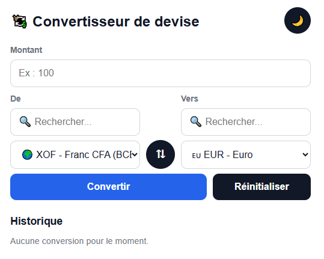

# 💱 Convertisseur de devise

Une application web moderne de conversion de devises réalisées en HTML, CSS et JavaScript.

## ✨Fonctionnalités

- Conversion de devises en temps réél
- Recherche dynamique des devises
- Graphique de l'évolution du taux sur 30 jours 📈
- Aperçu du montant dans les devises populaires
- Historique des conversions avec horodatage
- Relance d'une conversion en cliquant dans l'historique
- Suppression individuelle de l'historique
- Sauvegarde avec localStorage
- Mode sombre 🌙
- Copier le résultat 📋
- Inversion des devises 🔄
- Affichage du taux exact avec sa date
- Formatage des nombres à la française (séparateurs de milliers)
- Drapeaux des devises 🇪🇺🇺🇸
- Loader de chargement ⏳
- Responsive mobile 📱
- Support du Franc CFA BCEAO (XOF) via la parité fixe EUR/XOF (1 EUR = 655,957 XOF)

## 🛠️ Technologies utilisées

- HTML5
- CSS3
- JavaScript
- API Frankfurter

## 📸 Screenshot



## 🌍 Lien live

👉 https://malikatoukouta.github.io/Convertisseur-de-devise/

## 🚀 Installation

1. Cloner le projet

```bash
git clone https://malikatoukouta.github.io/Convertisseur-de-devise/
```

2. Ouvrir le dossier du projet

3. Lancer avec Live Server dans VS Code

## 📂 Structure du projet

```text
convertisseur-devise/
│
├── index.html
├── style.css
├── script.js
├── README.md
└── Capture.png
```

## 👨‍💻 Auteur

Projet réalisé par Adamou Abdourmalik.